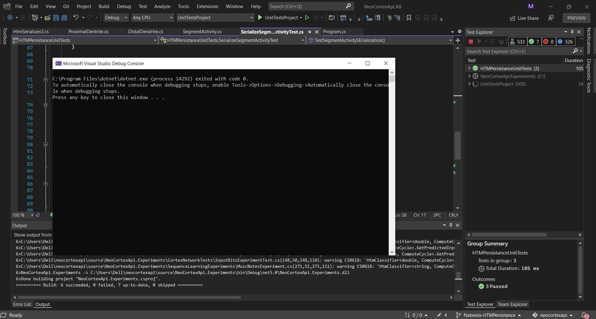
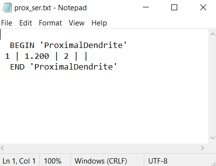
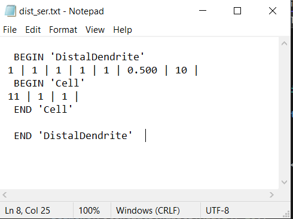
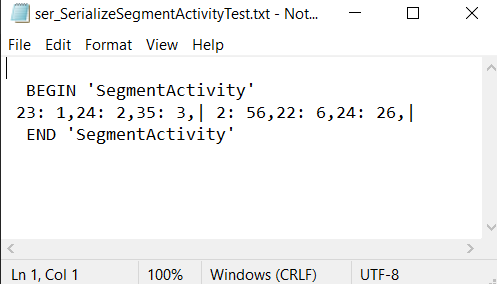
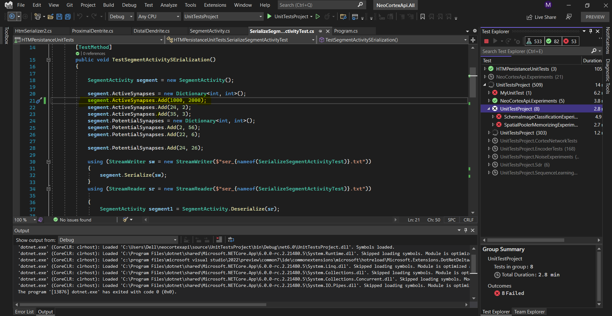

# HTM Persistance

# Project Description
Hierarchical temporal memory (HTM) is a biologically constrained machine intelligence technology developed by Numenta. Originally described in the 2004 book On Intelligence by Jeff Hawkins with Sandra Blakeslee, HTM is primarily used today for anomaly detection in streaming data. The technology is based on neuroscience and the physiology and interaction of pyramidal neurons in the neocortex of the mammalian (in particular, human) brain.
The persistence is designed as implementation of a custom serializer/deserilizer. The serializer saves the instance of some HTM module to the stream and deserializer is responsible to create the instance from the stream. 
# Analyse the current Implementation:

## - Logic of Serialization in HTMSerializer2.cs

Serialization class used for serialization and deserialization of primitive types. Such as Integer, Boolean, String, Array Int[], Double, Long, Cells and Synapse. Serializes the begin and end marker of the type. Serialize the property of type Int. Read the property of type Int and return that integer. Deserializes from text file to DistalDendrite and return DistalDendrite. Serialize the property of type Double, String, Long and Bool. Read the property of type Double, String, Long, Bool and return these values. Serialize the array of type Double. Read the array of type Double and return double. Serialize the array of type Int. Read the array of type Int returns Int[]. Serialize and Deserialize the array of cells. Deserializes from text file to Cell and return cells. Serialize the dictionary with key:string and value:int. Read the dictionary with key:string and value:int and return Dictionary<String, int>. Serialize the List of DistalDendrite, Synapses and Integer and Dictionary<Segment, List<Synapses>>. Read the List of DistalDendrite and returns distal dendrite. Serialize the dictionary and Concurrentdictionary with key:int and value:Synapse and DistalDendrite. Read the dictionary with key:int and value:Synapse return Dictionary<int, Synapse>

You can find more detail using the following link.

 [link to HTMSerializer](https://github.com/nabeelamaham/neocortexapi/blob/Nabeela-HTMPersistance/source/NeoCortexEntities/HtmSerializer2.cs)

- Structure of Serialization and Deserialization

1. Hierarchical Call

2. Specific methods in HTMSerializer2.cs
(for int, String, Array, int Array)

### 1. Serializes the begin and end marker of the type.

~~~csharp
public void SerializeBegin(String typeName, StreamWriter sw)
        {
            //
            // -- BEGIN ---
            // typeName
            sw.WriteLine();
            sw.Write($"{TypeDelimiter} BEGIN '{typeName}' {TypeDelimiter}");
            sw.WriteLine();

        }
        public String ReadBegin(string typeName)
        {
            string val = ($"{TypeDelimiter} BEGIN '{typeName}' {TypeDelimiter}");
            return val;
        }

        public void SerializeEnd(String typeName, StreamWriter sw)
        {
            sw.WriteLine();
            sw.Write($"{TypeDelimiter} END '{typeName}' {TypeDelimiter}");
            sw.WriteLine();
        }
        public String ReadEnd(String typeName)
        {
            string val = ($"{TypeDelimiter} END '{typeName}' {TypeDelimiter}");
            return val;
        }

~~~
2. Serialize the property of type Int. Read the property of type Int and return that integer.

~~~csharp
   public void SerializeValue(int val, StreamWriter sw)
        
        public void SerializeValue(object val, Type type, StreamWriter sw)
        
            public void DeserializeValue(object value, Type type)
        
  public int ReadIntValue(String reader)
        
~~~~
3. Deserializes from text file to DistalDendrite and return DistalDendrite.
~~~csharp
public Synapse DeserializeSynapse(StreamReader sr)
        
~~~
4. Serialize the property of type Double, string, Long, Bool, Array of type double and Array of type integer.
Read the property of type Double, string, Long, Bool, Array of type double and Array of type integer and return Double, string, Long, Bool, Array of type double and Array of type integer(int[]).
~~~csharp

public void SerializeValue(double val, StreamWriter sw)
        

            public Double ReadDoubleValue(String reader)
        
~~~
5.  and Deserialize the array of cells.
Deserializes from text file to Cell and return cells

~~~csharp
    public void SerializeValue(Cell[] val, StreamWriter sw)
         

            public Cell[] DeserializeCellArray(string data, StreamReader reader)
         
            public Cell DeserializeCell(StreamReader sr)
         

~~~

6. Serialize the dictionary with key:string and value:int.
Read the dictionary with key:string and value:int and return Dictionary<String, int>
~~~csharp
 public void SerializeValue(Dictionary<String, int> keyValues, StreamWriter sw)
         

            public Dictionary<String, int> ReadDictSIValue(string reader)
         

~~~
7. Serialize the dictionary with key:string and value:int[].
Read the dictionary with key:String and value:int[] and return Dictionary<String, int[]>.
~~~csharp
public void SerializeValue(Dictionary<String, int[]> keyValues, StreamWriter sw)
            public Dictionary<String, int[]> ReadDictSIarray(String reader)
         
~~~
8. Serialize the List of DistalDendrite.
Read the List of DistalDendrite and returns distal dendrite.
~~~csharp
    public void SerializeValue(List<DistalDendrite> distSegments, StreamWriter sw)
            public List<DistalDendrite> ReadListDendrite(StreamReader reader)
         

~~~
9.  the List of Synapse.
Read the List of Synapse and returns List<Synapse>.
~~~csharp
 public void SerializeValue(List<Synapse> value, StreamWriter sw)
           
            public List<Synapse> ReadListSynapse(StreamReader reader)
         
~~~
10. Serialize the List of Integers.
Read the List of Integers.
~~~csharp
 public void SerializeValue(List<int> value, StreamWriter sw)
         
        
            public List<int> ReadListInt(String reader)
         

~~~
11. Serialize the Dictionary<Segment, List<Synapse>>.
~~~csharp

  public void SerializeValue(Dictionary<Segment, List<Synapse>> keyValues, StreamWriter sw)
         
~~~
12. Serialize the dictionary with key:int and value:Synapse.
Read the dictionary with key:int and value:Synapse return Dictionary<int, Synapse>.
~~~csharp
 public void SerializeValue(Dictionary<int, Synapse> keyValues, StreamWriter sw)
         
        
            public int ReadKeyISValue(string reader)
         
         
~~~
 13. Serialize the Concurrentdictionary with key:int and value:DistalDendrite.

~~~csharp

    public void SerializeValue(ConcurrentDictionary<int, DistalDendrite> keyValues, StreamWriter sw)
~~~

# Classes in this Project:
I have Tested three classes in this project. These classes are listed below.
## 1. SegmentActivity:
Segmentactivity.cs stores the calculus of a temporal cycle. It contains the index of segments with number of synapses with permanence higher than threshold. A 
Dictionary, which holds the number of potential synapses of every segment.
Potential synspses are all established synapses between receptor cell and the segment's cell. Receprot cell was active cell in the previous cycle.

 [link to SAegmentActivity](https://github.com/nabeelamaham/neocortexapi/blob/Nabeela-HTMPersistance/source/NeoCortexEntities/Entities/SegmentActivity.cs)

~~~csharp
Dictionary[segment index, number of active synapses].
Dictionary [segment index, number of potential synapses].
~~~
Serialization and deserialization will be applied on SegmentActivity. 

## ProximalDendrite:

It defines th eproximal dentritte segment. Note the segment is used during SP compute operation.
TM does not use this segment.
It uses the pool of synapses in the receptive field.

 [link to ProximalDendrite](https://github.com/nabeelamaham/neocortexapi/blob/Nabeela-HTMPersistance/source/NeoCortexEntities/Entities/ProximalDentrite.cs)
 
~~~csharp
public ProximalDendrite(int colIndx, double synapsePermConnected, int numInputs) : base(colIndx, synapsePermConnected, numInputs)
        {

        }
~~~
It creates and returns a newly created synapse with the specified source cell, permanence, and index.
This method is only called for Proximal Synapses. For ProximalDendrites, there are many synapses within a pool, and in that case, the index specifies the synapse's sequence order within the pool object, and may be referenced by that index.
It returns the instance of the new synapse.
~~~csharp
public Synapse CreateSynapse(int index, int inputIndex)
~~~
Indicies of Array of connected inputs defines RF(Potential Pool). It clear all the synapses from the segment. Sets the permanences for each linked Synapse specified by the indexes passed in which identify the input vector indexes associated with the permanences passed in are understood to be in "sparse" format and therefore require the int array identify their corresponding indexes.
This is the "sparse" version of this method.
Returns an array of synapse indexes as a dense binary array. Returns an array of indexes of input neurons connected to this pool. It returns the indexes of connected input neurons.
~~~csharp
   public override void Serialize(StreamWriter writer)
        

        public static ProximalDendrite Deserialize(StreamReader sr)
        
~~~
##  DistalDendrite:

Implements a distal dendritic segment that is used for learning sequences. Segments are owned by Cells and in turn own Cells which are obversely connected to by a "source cell", which is the Cell that will activate a given Synapse owned by this Segment.

 [link to DistalDendriteDendrite](https://github.com/nabeelamaham/neocortexapi/blob/Nabeela-HTMPersistance/source/NeoCortexEntities/Entities/DistalDendrite.cs)
~~~csharp
  public class DistalDendrite : Segment, IComparable<DistalDendrite>, IEquatable<DistalDendrite>
    {
~~~  
The cell that owns (parent) the segment.  the last iteration in which this segment was active.
The seqence number of the segment. Specifies the order of the segment of the Connections instance. 
### - ParentCell:
 The cell, which owns the segment.
### - flatIdx: 
 The flat index of the segment. If some segments are destroyed (synapses lost permanence)then the new segment will reuse the flat index. In contrast, the ordinal number will increas when new segments are created.
lastUsedIteration
### - ordinal:
The ordindal number of the segment. This number is incremented on each new segment.
If some segments are destroyed, this number is still incrementd.
### - synapsePermConnected
### - numInputs
~~~csharp 
        public DistalDendrite(Cell parentCell, int flatIdx, long lastUsedIteration, int ordinal, double synapsePermConnected, int numInputs) : base(flatIdx, synapsePermConnected, numInputs)
~~~
It compares this segment with the given one and Compares by index as well.
It  Serialize method for DistalDendrite
~~~ csharp    
internal void SerializeT(StreamWriter writer)
        {
~~~                    
Then apply deserialization.   
~~~csharp        
        public static DistalDendrite Deserialize(StreamReader sr)
        {
        
~~~
# Test Classes for the project.
the following code is applide for testing the classes(SegmentActivity, DistelDendrite, pxorimalDendrite) 
Here is the link to the unit Test class.
 [link to project](https://github.com/nabeelamaham/neocortexapi/blob/Nabeela-HTMPersistance/source/HTMPersistanceUnitTests/SerializeSegmentActivityTest.cs)

~~~csharp
     public void TestSegmentActivitySErialization()
        {

            SegmentActivity segment = new SegmentActivity();

            segment.ActiveSynapses = new Dictionary<int, int>();
            segment.ActiveSynapses.Add(23, 1);
            segment.ActiveSynapses.Add(24, 2);
            segment.ActiveSynapses.Add(35, 3);
            segment.PotentialSynapses = new Dictionary<int, int>();
            segment.PotentialSynapses.Add(2, 56);
            segment.PotentialSynapses.Add(22, 6);

            segment.PotentialSynapses.Add(24, 26);

            using (StreamWriter sw = new StreamWriter($"ser_{nameof(SerializeSegmentActivityTest)}.txt"))
            {
                segment.Serialize(sw);
            }
            using (StreamReader sr = new StreamReader($"ser_{nameof(SerializeSegmentActivityTest)}.txt"))

            {
                SegmentActivity segment1 = SegmentActivity.Deserialize(sr);

                Assert.IsTrue(segment1.Equals(segment));
            }
        }

        [TestClass]
        public class DistalDendriteSerializationTest
        {
            [TestMethod]
            public void TestDistalDendriteSerialization()
            {
                Cell c1 = new Cell(1, 1, 10, 1, NeoCortexEntities.NeuroVisualizer.CellActivity.ActiveCell);

                DistalDendrite d1 = new DistalDendrite(c1, 1, 1, 1, 0.5, 10);

                using (StreamWriter sw = new StreamWriter("dist_ser.txt"))
                {
                    d1.Serialize(sw);
                }

                DistalDendrite d2;
                using (StreamReader sr = new StreamReader("dist_ser.txt"))
                {
                    d2 = DistalDendrite.Deserialize(sr);
                }

                var result = HtmSerializer2.IsEqual(d1, d2);
                Assert.IsTrue(result);
            }
        }

        [TestClass]
        public class ProximalDendriteSerializationTest
        {
            [TestMethod]
            public void TestProximalDendriteSerialization()
            {
                Cell c1 = new Cell(1, 1, 10, 1, NeoCortexEntities.NeuroVisualizer.CellActivity.ActiveCell);

                ProximalDendrite p1 = new ProximalDendrite(1, 1.2, 2);

                using (StreamWriter sw = new StreamWriter("prox_ser.txt"))
                {
                    p1.Serialize(sw);
                }

                ProximalDendrite p2;
                using (StreamReader sr = new StreamReader("prox_ser.txt"))
                {
                    p2 = ProximalDendrite.Deserialize(sr);
                }

                var result = HtmSerializer2.IsEqual(p1, p2);
                Assert.IsTrue(result);
~~~
# Result

## Output of Text Files:
### - ProximalDendrite.txt:

### - DistalDendrite.txt:

### - SegmentActivity.txt:

# Use Different Values
Use different values on the unit Test Class. Changed the value of ActiveSynapses on line 21 and the result is changed when put 1000 and 2000. 

